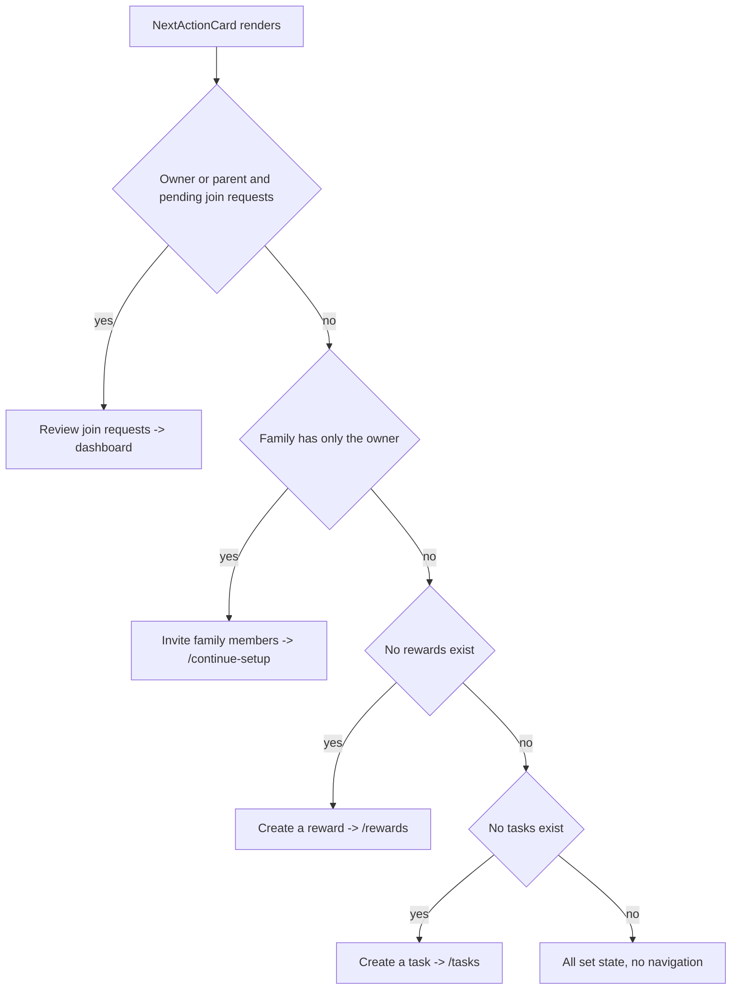

# Parent Activation System — Design Spec

- **Date:** 2026-08-01
- **Status:** APPROVED — implemented in Sprint 1
- **Branch under audit:** `todo-theme` @ `ddbb9cc`
- **Related sprint:** Sprint 1 (Parent onboarding surface)

> Approved by the product owner. Sprint 1 (R1–R5) is implemented via TDD with
> paired red/green commits; all acceptance criteria below are verified by
> `npx vitest run` and `npx tsc --noEmit`.

---

## 1. Goal

Make the parent's first-run and post-onboarding experience coherent and
actionable. The dashboard's "next action" must always point at the single most
valuable thing for the parent to do, must never dead-end on a redundant setup
CTA, must surface pending join requests, must key the reward step off the
`rewards` collection (not `savingsGoals`), and the invite entry point must offer
both a share-code path and a managed-child-account path.

## 2. Background & Current State (audit of HEAD)

Sprint 1 shipped the parent onboarding surface. The following were identified as
gaps but deliberately left unimplemented pending this spec:

| # | Gap | Current behaviour in HEAD | Evidence |
|---|-----|---------------------------|----------|
| 1 | Pending-invitation priority missing | `NextActionCard` never considers `joinRequests` | [`src/components/next-action/NextActionCard.tsx:17`](src/components/next-action/NextActionCard.tsx:17) |
| 2 | Reward step keyed off `savingsGoals` | Priority checks `savingsGoals.length === 0` → "Create a goal" | [`src/components/next-action/NextActionCard.tsx:29`](src/components/next-action/NextActionCard.tsx:29) |
| 3 | Completed-setup dead-end | When all steps done, card falls through to `continueSetup` → `/continue-setup` | [`src/components/next-action/NextActionCard.tsx:22`](src/components/next-action/NextActionCard.tsx:22) |
| 4 | No persistence test | No test proves setup progress survives reload / sign-out / re-entry | [`src/pages/ContinueSetup.test.tsx`](src/pages/ContinueSetup.test.tsx:1) |
| 5 | Invite lacks managed-child choice | `InviteMemberCard` is share-code only | [`src/components/dashboard/InviteMemberCard.tsx:10`](src/components/dashboard/InviteMemberCard.tsx:10) |

The store already exposes `rewards` ([`src/store/useStore.ts:126`](src/store/useStore.ts:126)) and
`joinRequests` ([`src/store/useStore.ts:122`](src/store/useStore.ts:122)), both subscribed during bootstrap
([`src/store/useStore.ts:729`](src/store/useStore.ts:729), [`src/store/useStore.ts:748`](src/store/useStore.ts:748)). No store schema change is required.

## 3. Requirements

### R1 — Surface pending join requests as top priority
When the current user is `owner` or `parent` and `joinRequests` contains at least
one request with `status === 'pending'`, `NextActionCard` MUST show **"Review join
requests"** as the highest-priority action and navigate to the dashboard root
(`/`) where the existing join-request review UI lives
([`src/components/parent/ParentDashboard.tsx:138`](src/components/parent/ParentDashboard.tsx:138)).

### R2 — Key the post-family step off `rewards`, not `savingsGoals`
After the family is populated, the next action MUST check `rewards.length === 0`
and show **"Create a reward"** navigating to `/rewards`. The `savingsGoals`
check currently used for "Create a goal" is removed from the priority chain.
`ContinueSetup` MUST mirror this: replace the `createGoal` step with a
`createReward` step (done when `rewards.length > 0`) and recompute
`allDone = hasFamily && hasRewards && hasTasks`.

> **Assumption (confirm at approval):** the intended onboarding reward signal is
> `rewards`, so the `createGoal` step is superseded by `createReward`. If goals
> should remain a separate step, say so and R2 will be adjusted to keep both.

### R3 — No redundant setup CTA when fully configured
When no pending join request exists and the family, rewards, and tasks are all
present, `NextActionCard` MUST render a completed "all set" state with **no
navigation button** (it must not link to `/continue-setup`). This removes the
onboarding dead-end.

### R4 — Setup progress survives reload / sign-out / re-entry
Add tests proving setup progress is a pure function of the store collections and
persists across `cleanup()` + `loadFamilyData()` re-hydration and across component
re-mount with a pre-populated store (simulating re-entry after reload).

### R5 — Invite entry offers share-code OR managed child account
`InviteMemberCard` MUST offer two distinct entry points:
1. **Share invite link / code** (existing behaviour, unchanged).
2. **Add child directly** — opens the existing managed-child modal
   (`AddChildModal`, already wired on [`src/components/parent/ParentDashboard.tsx:230`](src/components/parent/ParentDashboard.tsx:230))
   so an owner can create a managed child account without sending an invite.

## 4. Priority Algorithm (NextActionCard)

```
inputs: familyMembers, rewards, tasks, joinRequests, currentUser.role
ownerOrParent = role in [owner, parent]
pendingJoins  = ownerOrParent && joinRequests.some(r => r.status === 'pending')

if pendingJoins            -> Review join requests -> '/'
else if familyMembers <= 1 -> Invite family members -> '/continue-setup'
else if rewards.length === 0 -> Create a reward -> '/rewards'
else if tasks.length === 0   -> Create a task   -> '/tasks'
else                         -> All set (no navigation)
```

### Priority flow



## 5. Acceptance Criteria

- [x] **R1:** With a pending join request, `NextActionCard` shows "Review join
      requests" and navigates to `/` on click (test + manual).
- [x] **R2:** With a populated family and zero rewards, the card shows "Create a
      reward" → `/rewards`; `ContinueSetup` shows a `createReward` step and
      `allDone` requires rewards.
- [x] **R3:** With family + rewards + tasks present and no pending joins, the card
      shows a non-clickable "all set" state.
- [x] **R4:** New tests fail before the fix and pass after; they cover store
      re-hydration and component re-mount with pre-populated state.
- [x] **R5:** `InviteMemberCard` exposes both a share-code action and an
      "Add child directly" action that opens the managed-child modal.
- [x] All pre-existing tests still pass (52 tests across the dashboard,
      next-action, and continue-setup suites) and `tsc --noEmit` is clean.

## 6. i18n Changes

Add to BOTH `src/i18n/locales/en/dashboard.json` and
`src/i18n/locales/tr/dashboard.json` under `nextAction`:

| Key | en | tr |
|-----|----|----|
| `nextAction.reviewJoinRequests` | "Review join requests" | "Katılım isteklerini incele" |
| `nextAction.createReward` | "Create a reward" | "Bir ödül oluştur" |
| `nextAction.allSet` | "You're all set" | "Hazırsınız" |

For R5, add under `family:`:

| Key | en | tr |
|-----|----|----|
| `family:addChildDirectly` | "Add child directly" | "Çocuğu doğrudan ekle" |

(Reuse existing `family:inviteMember`, `common:copy`, `common:share` keys.)

## 7. Testing Strategy (TDD)

For each requirement, in this order, with **separate conventional commits**:

1. **Red** — write a failing test in the relevant `*.test.tsx` (or a store test).
2. **Green** — implement the minimal change in the source file.
3. **Refactor** — clean up; keep tests green.
4. Commit with a conventional message, e.g.
   `test: red — pending join requests surface in NextActionCard`,
   `feat: surface pending join requests as top next action`.

Suggested commit sequence (one per gap):
- `test` + `feat` for R1 (join requests priority)
- `test` + `feat` for R2 (rewards keyed step)
- `test` + `feat` for R3 (all-set state)
- `test` for R4 (persistence) — may be red+green in one logical pair
- `test` + `feat` for R5 (managed child entry)

Run `npx vitest run` after each pair; keep the uncommitted Sprint 1 tree intact
(no `git add` of unrelated files).

## 8. Non-Goals

- No change to Firestore schema or `useStore` subscriptions.
- No new invite/accept flow for share codes (existing behaviour preserved).
- No change to gamification engine, wallets, or goals subcollections.
- No change to the `shouldShowFamilySetupPrompt` logic
  ([`src/lib/familySetup.ts:12`](src/lib/familySetup.ts:12)).

## 9. Assumptions & Open Questions

1. **R2 goal→reward substitution** — confirm rewards supersede goals in onboarding
   (see §3 R2 note).
2. **R3 "all set" presentation** — confirm a non-clickable state is acceptable vs.
   hiding the card entirely.
3. **R5 modal reuse** — confirm reusing the existing `AddChildModal` is sufficient
   for the managed-child path (no new modal component).
4. **R1 navigation target** — confirm `/` (dashboard) is the right destination for
   reviewing joins, given the review UI already lives there.
